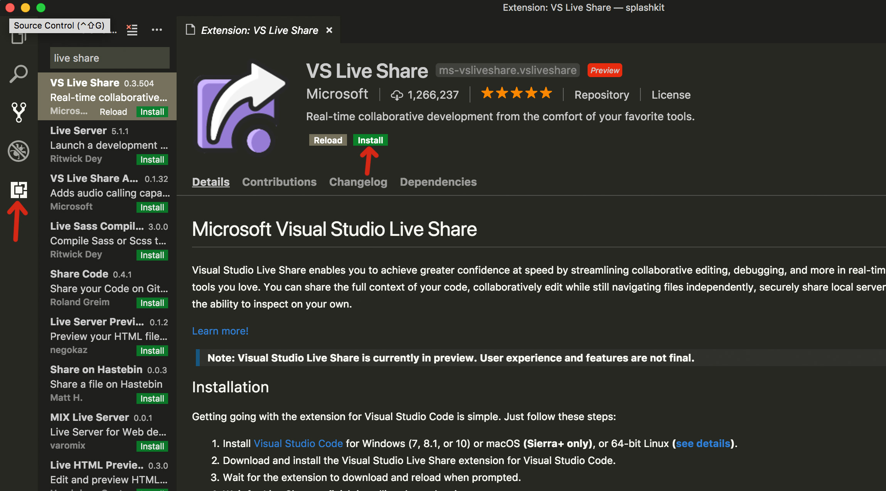
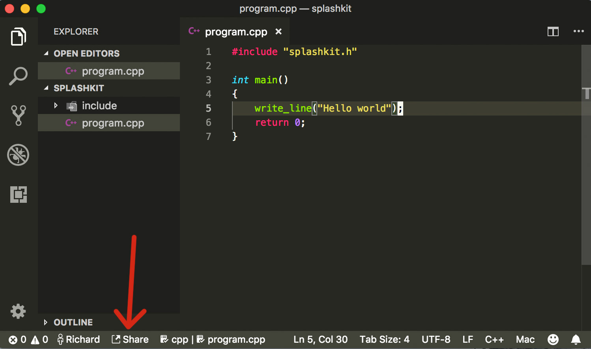
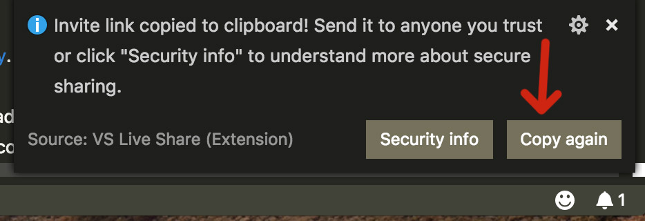
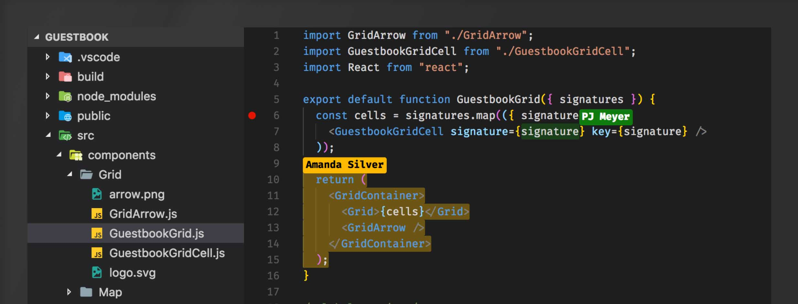

# Cloud code sharing guide

Sharing your code for real-time collaboration is easy using [Visual Studio Code](https://code.visualstudio.com/) and
[Live Share](https://visualstudio.microsoft.com/services/live-share).

Your entire code project will become accessible by whomever you share the link with,
allowing you collaborate in real-time on your code.

## Installing Live Share

Assuming you have already installed (and are using) `Visual Studio Code`, you
can install `Live Share` using the instructions below.

### 1. Install The Live Share Extension

Open `Visual Studio Code` and press the extensions button. Search for `VS Live Share`
and press Install.

You may need to restart `Visual Studio Code` to complete the installation.

### 2. Sharing your workspace

To begin sharing your work space, open your code in `Visual Studio Code` and press
the `Share` button in the footer menu. The first time around, you'll need to
sign in with either Microsoft or GitHub.

### 3. Giving access to others

You'll notice a popup appear telling you that a link has been copied to your
clipboard. This means you can now right click and press "paste" anywhere to send
this link to someone else.

__Important note:__ Sending this link will give anyone with access to it the 
ability to potentially modify your files. Only give the link to someone you trust.

### 4. Done

As people join your work space, you should see their name and cursor appear in
your text editor.

